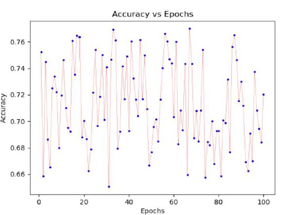
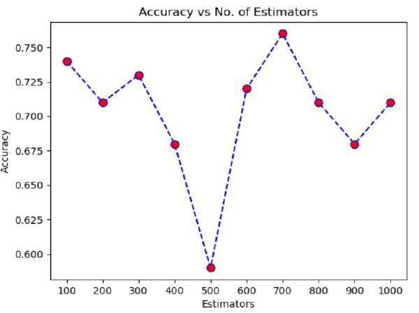

# Detect_Heavy_Drinking_Episodes 
### (replication of the model presented in the paper [1] )

## Objective:
   - Indication of what attribute(s) were being predicted
       1. Features: Three-axis time series accelerometer data
       2. Target: Time series transdermal alcohol content (TAC) data (real-time measure of intoxication)
   - Indication of study's results
   
       The study decomposed each time series into 10 second windows and performed binary classification to predict if windows corresponded to an intoxicated participant (TAC >= 0.08) or sober participant (TAC < 0.08). The study tested several models and achieved a test accuracy of 77.5% with a random forest.
       
## Overview:
The research paper mentioned takes into account the issue of heavy drinking among youngsters and aims to provide a solution by detecting heavy drinking episodes so that such occurrences can be controlled by intimidation at the right time. Also, it uses the easily available accelerometer data from the individual’s cell phone, thus avoiding any possible breach of privacy of the individual. And this model exhibits efficient usability, as a system/app can be developed using this to alert the individual during such heavy drinking episodes. 
Preprocessing the time series data by feature extraction to make it usable for classification is one of the major tasks in this implementation. It gives an insight into how data with time and frequency components are handled in real life scenarios.
The model we implemented gives an accuracy of 77.5%. We also learnt about the importance of tuning the parameters for getting a good working model. 

## Results:
       

Fig1. Hyper-parameter number of trees or estimators in the random forest classifier is plotted against the accuracy. It is clearly visible that using 700 trees to train and test the model gives the best accuracy i.e. approximately 0.76. So we choose the number of trees in the random forest to be 700.

Fig2. This graph depicts the accuracy of the model using the tuned parameters (number of estimators as 700, other parameters are mentioned in the model performance section) over 100 epochs. Over the 100 epochs, the accuracy is always around 0.71 - 0.77 giving the average accuracy of approximately 0.76

## Database Description:
### Folders:
- clean_tac: Contains TAC readings for each pid. There were 13 participants which were included, so there are 13 csvs for TAC readings. Name Convention: <pid> + '_clean_TAC.csv'
	
- accelerometer: Contains accelerometer data for each pid. Name Convention: 'accelerometer_' + <pid> + '.csv'
	
- features: Create this folder where model.py python script is kept. Inside this folder, each of the 16 features that we have used, will be created for each pid if you run the extract_dataframes() function in the model.py script.
	
- dataset: Create this folder where model.py python script is kept. Inside this folder, the features for each pid is stored in concatenated form with their respective tac_label in their csvs. Name convention: <pid> + '_data.csv'
	
### Files:
- data.csv: This file is created in the dataset folder when you run the function create_dataset() in the model.py script.
- utils.py: This file is used for extracting features using accelerometer sample.
- feature_extraction.py: This file is also used for extracting features using accelerometer sample but this a python script of PyAudioAnalysis package of python for extracting features from  time seris data. We have used the source code present at this link: https://github.com/tyiannak/pyAudioAnalysis/blob/master/pyAudioAnalysis/ShortTermFeatures.py
- model.py: THis file contains the main functions required for running the Random Forest Classifier model.

### How to run the model.

Order of functions to be run in the model.py script:

- extract_dataframes(): This function will map features extracted using accelerometer data with its corresponding TAC_reading for each pid.

- create_dataset(): This function will create the dataset by concatenating the csvs created in the above function.

- model(): This function will initialize Random Forest Classifier with the best parameters that we tuned using GridSearchCV. The tuning of parameters is done in the hyperParamTuning() function created inside model() function. 

## References:
[1] hKillian, J. A., Passino, K. M., Nandi, A., Madden, D. R., & Clapp, J. Learning to Detect Heavy Drinking Episodes Using Smartphone Accelerometer Data.

